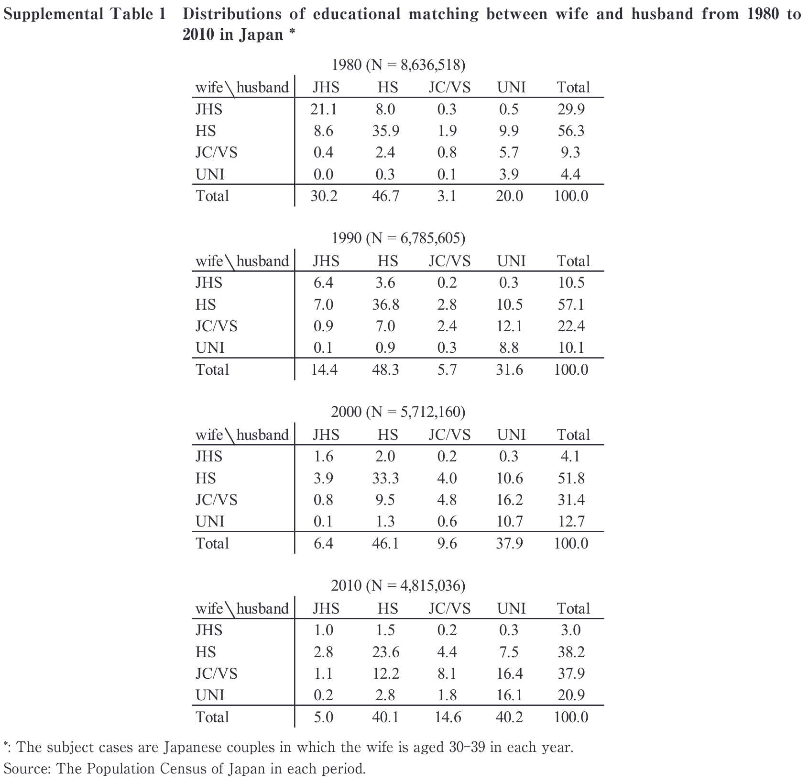

# データの読み込み
本報告では[Fukuda et al.(2021)](https://www.jstage.jst.go.jp/article/jps/57/0/57_2101001/_article/-char/en)のSupplemental Tableとして掲載されているデータを用いる。これは「国勢調査」の調査票情報を用いて、妻が30-39歳の夫婦の学歴組み合わせを示すクロス集計表である。例えば、以下は1980年の「国勢調査」にもとづく夫婦の学歴組み合わせである。

```{r, echo = FALSE}
CensusDir <- "CensusCSV/CSV_EduWH/"
EduWH1980_raw <- read.csv(paste0(CensusDir, "EduWH1980.csv"), header = FALSE)
EduWH1980_mat <- as.matrix(EduWH1980_raw)
EduWH1980     <- EduWH1980_mat
dimnames(EduWH1980) <- list(c("JHS", "HS", "VC/JC", "UNI"),
                            c("JHS", "HS", "VC/JC", "UNI"))

names(dimnames(EduWH1980)) <- c("EduW", "EduH")
```

```{r, echo = FALSE}
EduWH1980
```

表側には妻の学歴（`EduW`）、表頭には夫の学歴（`EduH`）がそれぞれ置かれている。ここに調査年（`CensusYear`）を追加すると、妻の学歴×夫の学歴×調査年の3変数からなる多元クロス集計表を作成することができる。

本報告では、上のようなクロス集計表のデータが事前に与えられている状況を想定して進めていく。具体的には、「国勢調査」の調査年別に$4\times4=16$セルの度数がCSVファイルなどで与えられているものとする。そのため、以下ではCSVファイルの出入力の基本操作を押さえておこう。

## CSVファイルの読み込み
まず、本報告で用いるCSVファイルは`CensusCSV/CSV_EduWH`フォルダに保存されている。ここには1980年、1990年、2000年、2010年の「国勢調査」を用いて集計された夫婦の学歴組み合わせのデータファイルが調査年ごとに保存されている。例えば、以下は1980年調査のデータファイルである^[[Fukuda et al.(2021)](https://www.jstage.jst.go.jp/article/jps/57/0/57_2101001/_article/-char/en)の付表として公開されているのはクロス集計表の全体度数と全体パーセントのみであるため、論文内の分析を完全に再現することができない。クロス集計表を用いた分析の再現性の担保のためには、クロス集計表の各セルの**度数**を公表すべきである。]。

 

CSVファイルの読み込みには`read.csv()`を用いる。この関数に最低限必要な引数は、読み込みの対象となるCSVファイルのパス（`file`）である。CSVファイルがワーキングディレクトリと同じ階層に保存されている場合はファイル名を文字列で引き渡せばよい。CSVファイルが異なる階層に保存されている場合は、相対パスあるいはフルパスでファイルの場所を指定する。その際、報告者個人が推奨する方法は、CSVファイルが保存されているフォルダのパスをオブジェクトと保存しておき、そのオブジェクトとファイル名の文字列とを`paste()`あるいは`paste0()`で結合する方法である。このようにしておくと、CSVファイルの保存場所が変更された場合でも、そのフォルダパスを示すオブジェクトのみを修正すればそれ以外のコードを修正する必要がないためである。

また、今回の例には当てはまらないが、1行目が変数名となっている場合は、`header = TRUE`とすると（むしろ、こちらがデフォルトの設定）1行目は変数名として処理され、2行目からobservationとして認識される。

```{r}
CensusDir <- "CensusCSV/CSV_EduWH/"
FN_EduWH1980csv <- paste0(CensusDir, "EduWH1980.csv")

EduWH1980_raw <- read.csv(file = FN_EduWH1980csv, header = FALSE) # "file = "は省略可
```

`read.csv()`でデータを読み込んだ直後のオブジェクトの型はデータフレームになっている。今回raw dataとして読み込んだのは行列の形をしたクロス集計表であるため、以下のように行列に変換する必要がある。

```{r}
# CSVファイルを読み込んだ直後の型はデータフレームになっている
class(EduWH1980_raw) 

# as.matrix()でオブジェクトの型を行列に変換
EduWH1980_mat <- as.matrix(EduWH1980_raw)

class(EduWH1980_mat)

EduWH1980_mat
```
こうしてデータの型をデータフレームから行列に変換できたものの、この段階では各行および各列がそれぞれどのカテゴリを示すのかが明瞭ではない。そこで、`dimnames()`を用いて行列の次元にラベルをつけておくと便利である。`dimnames()`はオブジェクトの各次元のラベルをリスト（`list`）として返す関数である。

```{r}
EduWH1980 <- EduWH1980_mat
class(dimnames(EduWH1980))
dimnames(EduWH1980)
```

列（column）のラベル（"V1"-"V4"）のみが保存されており、行ラベルは空であることがわかる。夫婦の学歴カテゴリを示すラベルを付与するためには以下のようにリストとして代入する。

```{r}
dimnames(EduWH1980) <- list(c("JHS", "HS", "VC/JC", "UNI"),
                            c("JHS", "HS", "VC/JC", "UNI"))

EduWH1980
```
行カテゴリ・列カテゴリが付与されたが、さらに`names()`と`dimnames()`とを組み合わせることで行方向・列方向それぞれの変数名も付与できる。
```{r}
names(dimnames(EduWH1980)) <- c("EduW", "EduH")

# 完成!
EduWH1980
```

## CSVファイルの出力
つづいて、`R`の上で作成したオブジェクトを外部ファイルに出力する方法について見ておこう。オブジェクトはさまざまなフォーマットで出力可能であるが、ここではCSVファイルの出力方法について説明する。

### 出力するオブジェクトの準備
前節ではすでに調査年ごとのクロス集計表がCSVファイルの形式で用意されていることを前提に、CSVファイルを読み込む方法を見てきた。しかしながら、[Fukuda et al.(2021)](https://www.jstage.jst.go.jp/article/jps/57/0/57_2101001/_article/-char/en)で公表されているのは、以下のように、調査年ごとの夫婦学歴組み合わせのクロス集計表の**全体度数**と**全体パーセント**のみである。

 

そこで、これらの情報に基づいてクロス集計表のセル度数を算出し、それらをCSVファイルに出力してみよう。例として2010年のクロス集計表を取り上げる。まず、以下のように全体パーセントを入力したデータをCSVファイルとして保存しておく。

 

つぎに、このCSVファイルを`R`に取り込んでおく。
  
```{r}
# パラメータの設定
SupTabsDir <- "CensusCSV/SupplementalTables/" # 全体パーセントのCSVファイルが保存されているディレクトリ
OutDir     <- "CensusCSV/CSV_EduWH/"          # 出力先ディレクトリ
NofObs <- 481536　　# 全体度数

# 全体パーセントの読み込み
TotProp2010_raw <- read.csv(paste0(SupTabsDir, "TotProp2010.csv"), header = FALSE)
TotProp2010 <- as.matrix(TotProp2010_raw)
TotProp2010
```

クロス集計表の全体パーセントを行列として読み込めたら、あとはそれらを比率に変換した上で全体度数を乗じればセル度数が得られるので、

```{r}
# セル度数の算出
EduWH2010 <- NofObs * (TotProp2010 / 100)
EduWH2010
```

とすれば、2010年の夫婦の学歴組み合わせのクロス集計表が得られる。

### `write.csv()`
CSVファイルを出力するための関数のひとつが`write.csv()`である。第1の引数として保存するオブジェクト名を指定し、`file`には保存するファイル名を（パスも含めて）指定する。`row.names = FALSE`を指定しないと、第1列目に行ラベル（ない場合は行番号）が表示される。

```{r, eval = FALSE}
write.csv(EduWH2010, file = paste0(OutDir, "EduWH2010_writecsv.csv"), row.names = FALSE)
```

保存されたCSVファイルを開いてみると、第1行目に列名（変数名）が表示されていることがわかる。このままでも必要な情報（セル度数）は保存されているので大きな問題ではないが、列名も表示させたくない場合は`write.table()`を使うと良い。

 

### `write.table()`
`write.table()`では`col.names`という引数を指定でき、これを`FALSE`にすると列名が表示されなくなる。この関数を用いてCSVファイルを出力する際にはセパレータ`sep`をカンマにしておく。

```{r, eval = FALSE}
write.table(EduWH2010, file = paste0(OutDir, "EduWH2010.csv"), sep = ",", row.names = FALSE, col.names = FALSE)
```
保存されたCSVファイルを確認すると、列名が保存されていないことがわかる。

 